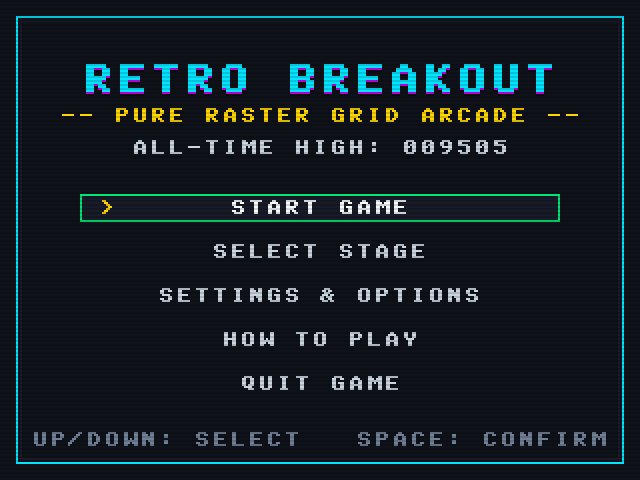
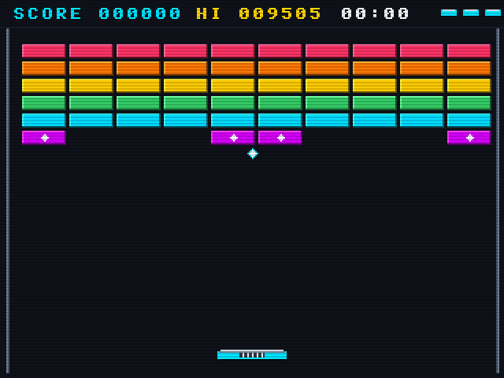
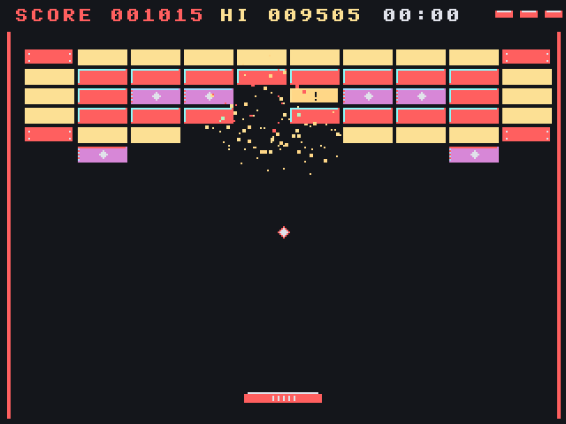
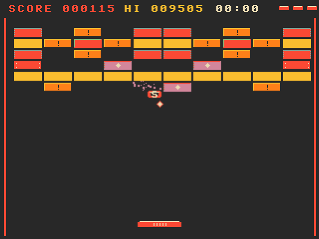
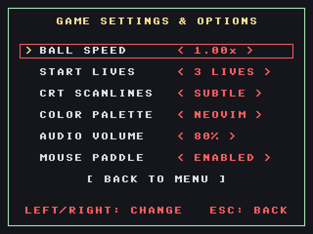
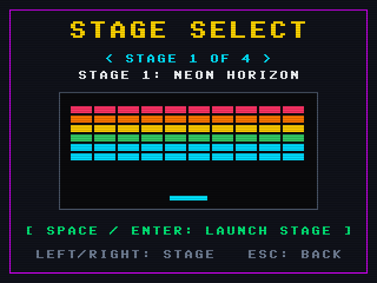

# Retro Breakout (Qt 6 & Pure Software Raster Grid)

An arcade-authentic Breakout game built in **C++20** and **Qt 6**, designed from the ground up with a **pure software raster grid** (no OpenGL, no hardware vector smoothing), sub-stepped continuous collision physics, extensible JSON level loading, power-up items, and first-class multi-IDE support (Neovim, VS Code, Qt Creator, CLion).

---

## 🕹️ Screenshots & Gameplay Demos

| Main Menu (Pure Raster Grid) | Stage 1: Neon Horizon |
| :---: | :---: |
|  |  |

| Stage 2: Neovim Palette (Quack Theme) | Stage 3: Gruvbox Explosive Minefield |
| :---: | :---: |
|  |  |

| In-Game Settings & Options | Interactive Stage Carousel & Mini-Map |
| :---: | :---: |
|  |  |

---

## Highlights & Features

- **Pure Software Raster Pipeline**:
  - Internal virtual resolution fixed at **`320 × 240`** (classic 4:3 arcade ratio).
  - Every pixel, primitive, sprite, and particle is drawn in software into a 32-bit ARGB framebuffer.
  - Custom embedded **8×8 retro bitmap font** (zero system vector font dependencies).
  - Crisp nearest-neighbor integer scaling with aspect-ratio letterboxing.
  - Optional software **CRT scanlines** and **pixel grid** post-processing filters.
  - **6 Distinct Palette Modes**:
    1. **Neon Arcade**: Classic vibrant retro neon
    2. **Dark OLED**: Deep obsidian black with electric ice cyan & neon magenta
    3. **Gruvbox**: Legendary warm retro earthy palette (`#282828`, `#ebdbb2`, `#cc241d`, `#98971a`, `#d79921`, `#83a598`)
    4. **Neovim (Quack)**: Authentic dark slate editor palette (`#14161b` bg, `#e0e2ea` fg, `#8cf8f7` cyan, `#b3f6c0` green, `#fce094` yellow, `#ff5f5f` red, `#d787d7` purple)
    5. **Game Boy**: 4-shade nostalgic LCD green
    6. **Cyberpunk Amber**: Warm phosphor CRT amber monochrome

- **Arcade Continuous Physics & Deflection**:
  - Sub-stepped motion integration (4 sub-steps per frame) eliminates tunneling through thin bricks.
  - Dynamic paddle deflection based on relative hit impact offset from center with tangential paddle velocity (spin) transfer.
  - Direct 1:1 mouse paddle tracking with zero lag.
  - Minimum vertical speed clamping prevents boring horizontal bounce loops.
  - Accurate AABB edge vs. corner collision penetration resolution.

- **9 Power-Up Collectibles**:
  - **[E] Elongate**: Expands paddle width.
  - **[S] Shrink**: Penalty - reduces paddle width.
  - **[M] Multi-Ball**: Clones all active balls into 3 balls with diverging trajectories.
  - **[F] Fireball**: Penetrates directly through bricks without bouncing.
  - **[L] Laser Cannon**: Mounts twin blaster cannons to paddle wings (fire with `Space`).
  - **[C] Sticky Catch**: Catches ball on paddle; aim and launch with `Space`.
  - **[Z] Slow-Mo**: Decreases ball velocity by 35% for precise control.
  - **[B] Safety Barrier**: Deploys an energy barrier at the bottom pit that saves 1 lost ball.
  - **[+] Extra Life**: Increments remaining lives.

- **Seamless In-Game Menus & Retro UI**:
  - No separate OS popup dialogs — everything is seamlessly drawn right into the pixel raster grid!
  - **Main Menu**: Start Game, Select Stage, Settings & Options, How to Play, Quit.
  - **Stage Select**: Interactive stage carousel with real-time pixel mini-map previews.
  - **In-Game Options**: Ball speed/difficulty (0.6x to 1.8x), starting lives (1-9), CRT scanlines, 6 color palettes, audio volume/mute, and mouse tracking.
  - Mouse hover cleanly highlights rows without modifying settings; settings change exclusively on explicit left-click or arrow keys!
  - **Pause Menu**: Press `P` or `Esc` mid-game to pause and access Resume, Restart, Options, Stage Select, or Main Menu.

- **Crystalline Piano "Ting Ting" Audio Engine**:
  - Replaces harsh raw square waves with harmonic additive synthesis creating satisfying, bell-like electric piano / kalimba "ting" sounds.
  - Every brick hit ascends through an 8-note musical pentatonic scale (C5, D5, E5, G5, A5, C6, D6, E6) as your combo builds!
  - Warm woody marimba thud on paddle bounces and soft crystal ticks on wall bounces.
  - Polyphonic, zero-latency playback via `QSoundEffect`.

- **Flawless Fullscreen & Scaling**:
  - Automatically scales to the largest possible size centered in the display with pitch-black arcade letterboxing.
  - Supports both **Integer Scaling** (100% razor-sharp pixel grid) and **Proportional 4:3 Fit**.
  - No top-left misalignment bugs when resizing or switching palette themes.

- **Extensible JSON Level Pipeline**:
  - Easily design new stages by adding a `.json` file to `assets/levels/`.
  - Includes 4 built-in stages with progressive challenges:
    1. *Stage 1: Neon Horizon*
    2. *Stage 2: Armored Fortress*
    3. *Stage 3: Explosive Minefield*
    4. *Stage 4: Citadel Matrix*

---

## Controls & Keybindings

| Action | Primary Key | Secondary / Cross-Platform |
| :--- | :--- | :--- |
| **Move Paddle Left** | `Left Arrow` | `A` |
| **Move Paddle Right** | `Right Arrow` | `D` |
| **Mouse Tracking** | Move mouse horizontally | Cursor glides paddle smoothly |
| **Launch Ball / Fire Lasers / Continue** | `Spacebar` | Left Mouse Click |
| **Pause / Resume** | `P` | `Escape` |
| **Restart Current Stage** | `R` | Menu: `Game -> Restart` |
| **In-Game Settings** | `Ctrl ,` (Win/Linux) | `Cmd ,` (macOS) |
| **Zoom In** | `Ctrl +` / `=` | `Cmd +` |
| **Zoom Out** | `Ctrl -` / `-` | `Cmd -` |
| **Auto-Fit Window** | `Ctrl 0` / `0` | `Cmd 0` |
| **Fullscreen Toggle** | `F11` | `F` |

---

## Building from Source

### Prerequisites
- Modern C++ compiler supporting **C++20** (Apple Clang 15+, GCC 12+, Clang 15+, MSVC 2022+)
- **CMake** 3.19 or higher
- **Qt 6** (Qt6 Core, Gui, Widgets, optional Multimedia)

### Build Commands

```bash
# 1. Clone repository
git clone https://github.com/your-username/Breakout-game.git
cd Breakout-game

# 2. Configure build with compile commands exported
cmake -B build -DCMAKE_EXPORT_COMPILE_COMMANDS=ON

# 3. Build project
cmake --build build -j$(nproc 2>/dev/null || sysctl -n hw.ncpu 2>/dev/null || echo 4)
```

### Running the Game

- **macOS**:
  ```bash
  ./build/Breakout-game.app/Contents/MacOS/Breakout-game
  ```
- **Linux / Windows**:
  ```bash
  ./build/Breakout-game
  ```

---

## IDE & Neovim (`clangd`) Integration

This repository includes a configured [`.clangd`](file:///.clangd) file that automatically points language servers to `build/compile_commands.json`:

```yaml
CompileFlags:
  CompilationDatabase: "build"
  Add:
    - -std=c++20
    - -Wall
    - -Wextra
    - -Wno-unused-parameter

Diagnostics:
  UnusedIncludes: Strict

InlayHints:
  Enabled: true
  ParameterNames: true
  DeducedTypes: true
```

### Neovim Setup
Whether using `nvim-lspconfig`, `Mason`, or `coc-clangd`, simply ensure `build` is configured once (`cmake -B build -DCMAKE_EXPORT_COMPILE_COMMANDS=ON`).
When opening any C++ file in Neovim, `clangd` will automatically pick up the compile flags, Qt 6 include headers, and definitions with **zero diagnostic errors**.

### Formatting
A [`.editorconfig`](file:///.editorconfig) is included to enforce 4-space indentation, UTF-8 encoding, and trailing whitespace cleanup across all text editors.

---

## Creating Custom Levels

New levels can be authored in `assets/levels/level<N>.json`:

```json
{
  "name": "MY CUSTOM STAGE",
  "brickWidth": 28,
  "brickHeight": 9,
  "startX": 14,
  "startY": 28,
  "spacingX": 2,
  "spacingY": 2,
  "rows": [
    "X22222222X",
    "2111111112",
    "21PPEEPP12",
    "2111111112",
    "X22222222X"
  ],
  "legend": {
    ".": "empty",
    "1": { "type": "normal", "hp": 1, "color": "0xFF00E5FF" },
    "2": { "type": "armored", "hp": 2, "color": "0xFFFFD600" },
    "3": { "type": "armored", "hp": 3, "color": "0xFFFF1744" },
    "X": { "type": "indestructible", "hp": 999, "color": "0xFF718096" },
    "E": { "type": "explosive", "hp": 1, "color": "0xFFFF6D00" },
    "P": { "type": "powerup", "hp": 1, "color": "0xFFD500F9" }
  }
}
```

The `LevelManager` automatically discovers all `.json` files in `assets/levels/` on startup.

---

## Architecture Overview

```text
src/
├── main.cpp                # Application entrypoint
├── core/
│   ├── Config.h            # 320x240 resolution, speeds, ARGB palettes
│   ├── GameEngine.h/cpp    # State machine, sub-step collision logic, HUD
│   └── LevelManager.h/cpp  # JSON level parser, embedded fallbacks
├── physics/
│   ├── Vec2.h              # 2D vector math helper
│   └── Collision.h/cpp     # Circle-AABB, swept & sub-step collision
├── raster/
│   ├── RasterBuffer.h/cpp  # Software 320x240 ARGB pixel buffer & primitives
│   ├── BitmapFont.h/cpp    # 8x8 retro monochrome font table (ASCII 32-126)
│   └── ParticleSystem.h/cpp# Software pixel sparks, dust, and explosions
├── entities/
│   ├── Paddle.h/cpp        # Paddle input, width animation, laser cannons
│   ├── Ball.h/cpp          # Ball physics, angle deflection, fireball, trail
│   ├── Brick.h/cpp         # Health, damage crack stages, bevel rendering
│   ├── PowerUp.h/cpp       # Falling capsule items & duration timers
│   └── Laser.h/cpp         # Twin blaster projectiles
├── audio/
│   └── SoundManager.h/cpp  # Crystalline piano/kalimba harmonic synthesizer (ting ting)
└── ui/
    ├── MainWindow.h/cpp    # Native menubar, window zoom, fullscreen toggle
    └── RasterWidget.h/cpp  # Viewport centering & nearest-neighbor pixel scaler
```
