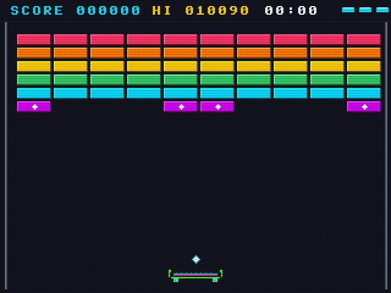

# Retro Breakout

A modern, high-performance arcade Breakout experience engineered in **C++20** and **Qt 6**. Retro Breakout features authentic software rasterization, continuous sub-stepped physics, dynamic cosmetics, harmonic sound synthesis, and an extensible JSON stage pipeline.

---

## 🕹️ Gameplay Demo

<div align="center">
  
  <p><em>Real-time 60 FPS gameplay showcasing the Street Skateboard paddle, particle physics, and combo audio.</em></p>
</div>

### Screenshots & Themes

| Main Menu | Stage Select & Mini-Maps |
| :---: | :---: |
|  |  |

| Settings & Presets | Stage 2: Neovim Green-Cyan Theme |
| :---: | :---: |
|  |  |

---

## Key Features

- **Retro Raster Graphics Engine**:
  - Native **320 × 240** virtual resolution with nearest-neighbor integer scaling and aspect-ratio letterboxing.
  - Software-rendered raster primitives, particle sparks, and embedded 8×8 bitmap typography.
  - Six curated colorways: **Neon Arcade**, **Dark OLED**, **Gruvbox**, **Neovim** (cool green-cyan), **Game Boy**, and **Amber CRT**.
  - Configurable CRT scanline simulation.

- **Board & Ball Presets**:
  - Selectable directly inside **Settings & Options**.
  - **Board Presets**: Street Skateboard (grip tape, kicktails, trucks & urethane wheels), Classic Arcade, Cyber Hovercraft, and Retro Wood.
  - **Ball Presets**: Energy Orb, Plasma Core, Neon Diamond, and Cyber Cube.

- **Continuous Sub-Stepped Physics**:
  - 4 sub-steps per frame physics integration to eliminate tunneling at extreme ball speeds.
  - Surface-normal penetration resolution with angle deflection determined by paddle impact position and tangential spin velocity.
  - Responsive keyboard navigation and 1:1 mouse paddle tracking.

- **Power-Up Arsenal**:
  - **[E] Elongate**: Expands paddle width.
  - **[S] Shrink**: Narrows paddle width.
  - **[M] Multi-Ball**: Clones active balls with diverging trajectories.
  - **[F] Fireball**: Pierces through bricks without deflection.
  - **[L] Laser Cannon**: Equips twin blasters fired via `Spacebar`.
  - **[C] Sticky Catch**: Locks ball to paddle for tactical re-aiming.
  - **[Z] Slow-Mo**: Lowers ball speed for precision shots.
  - **[B] Safety Barrier**: Deploys a bottom energy floor to save lost balls.
  - **[+] Extra Life**: Grants an additional life.

- **Harmonic Audio Synthesis**:
  - Additive synthesis producing crystalline kalimba/piano tones.
  - Brick strikes ascend an 8-note musical pentatonic scale (**C5 $\to$ E6**) as combos mount.
  - Zero-latency polyphonic playback.

- **6 Progressive Stages & JSON Custom Levels**:
  - Built-in stages ranging from standard brick arrays to explosive diamond labyrinths and cascade minefields.
  - Data-driven level loader allowing custom levels via JSON files in `assets/levels/`.

---

## Controls

| Action | Primary | Secondary / Alternative |
| :--- | :--- | :--- |
| **Move Paddle** | `Left` / `Right` Arrow | `A` / `D` or Mouse horizontal movement |
| **Launch Ball / Fire Lasers** | `Spacebar` | Left Mouse Click |
| **Pause / Resume** | `P` | `Escape` |
| **Restart Stage** | `R` | Menu: `Game -> Restart` |
| **Settings / Options** | `Ctrl + ,` (Win/Linux) | `Cmd + ,` (macOS) |
| **Adjust Window Zoom** | `Ctrl +` / `Ctrl -` | `Cmd +` / `Cmd -` |
| **Reset Window Size** | `Ctrl + 0` | `Cmd + 0` |
| **Toggle Fullscreen** | `F11` | `F` |

---

## Quick Start

### Build & Run

Ensure you have **CMake 3.19+** and **Qt 6** installed.

```bash
# Clone the repository
git clone https://github.com/asadzman/Breakout-game.git
cd Breakout-game

# Configure and compile
cmake -B build -DCMAKE_EXPORT_COMPILE_COMMANDS=ON
cmake --build build -j

# Run on macOS
./build/Breakout-game.app/Contents/MacOS/Breakout-game

# Run on Linux or Windows
./build/Breakout-game
```

For complete platform guides (Ubuntu, Fedora, Arch, Windows vcpkg) and IDE configurations (Neovim, VS Code, CLion, Qt Creator), see **[BUILD.md](BUILD.md)**.

---

## Authoring Custom Levels

Create a JSON file inside `assets/levels/level<N>.json`:

```json
{
  "name": "STAGE 7: CUSTOM ARENA",
  "brickWidth": 28,
  "brickHeight": 9,
  "startX": 14,
  "startY": 28,
  "spacingX": 2,
  "spacingY": 2,
  "rows": [
    "X22222222X",
    "2111111112",
    "21PPEEPP12",
    "2111111112",
    "X22222222X"
  ],
  "legend": {
    ".": "empty",
    "1": { "type": "normal", "hp": 1, "color": "0xFF00E5FF" },
    "2": { "type": "armored", "hp": 2, "color": "0xFFFFD600" },
    "3": { "type": "armored", "hp": 3, "color": "0xFFFF1744" },
    "X": { "type": "indestructible", "hp": 999, "color": "0xFF718096" },
    "E": { "type": "explosive", "hp": 1, "color": "0xFFFF6D00" },
    "P": { "type": "powerup", "hp": 1, "color": "0xFFD500F9" }
  }
}
```

New levels placed in `assets/levels/` are automatically registered on game startup.

---

## Project Structure

```text
Breakout-game/
├── CMakeLists.txt              # CMake C++20 build definition
├── .clangd                     # Compilation database mapping for LSPs
├── assets/
│   ├── demos/                  # Recorded gameplay GIF and MP4
│   ├── screenshots/            # Showcase images
│   └── levels/                 # JSON level definitions (Stages 1–6)
└── src/
    ├── main.cpp                # Entry point & headless demo generator
    ├── core/
    │   ├── Config.h            # Engine constants, palettes, and game states
    │   ├── GameEngine.h/cpp    # State machine, menus, and sub-stepped update loop
    │   └── LevelManager.h/cpp  # JSON stage loader & built-in fallbacks
    ├── physics/
    │   ├── Vec2.h              # 2D vector mathematics
    │   └── Collision.h/cpp     # Swept AABB & penetration resolution
    ├── raster/
    │   ├── RasterBuffer.h/cpp  # 320x240 ARGB buffer, scanlines, and palette filters
    │   ├── BitmapFont.h/cpp    # 8x8 bitmap font glyph table
    │   └── ParticleSystem.h/cpp# Software sparks, debris, and explosions
    ├── entities/
    │   ├── Paddle.h/cpp        # Board presets (Skateboard, Classic, Hover, Wood) & blasters
    │   ├── Ball.h/cpp          # Ball presets (Energy Orb, Plasma, Diamond, Cube)
    │   ├── Brick.h/cpp         # Health, fracture stages, and bevel rendering
    │   ├── PowerUp.h/cpp       # Power-up items and active timers
    │   └── Laser.h/cpp         # Twin blasters
    ├── audio/
    │   └── SoundManager.h/cpp  # Additive piano synthesizer & audio playback
    └── ui/
        ├── MainWindow.h/cpp    # Menubar, zoom scaling, and fullscreen toggle
        └── RasterWidget.h/cpp  # Viewport centering & nearest-neighbor pixel blit
```

---

## License

This project is open-source under the MIT License.
